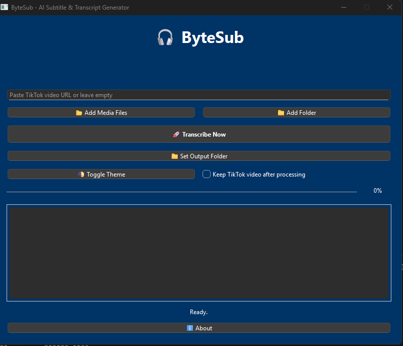

# ByteSub - AI Subtitle & Transcript Generator 🎧

**ByteSub** is a powerful AI-powered desktop application that automatically generates subtitles and transcripts from audio and video files using OpenAI's Whisper model.

## Features

- 🤖 **AI-Powered Transcription**: Uses Faster Whisper for accurate speech-to-text conversion
- 🎥 **TikTok Integration**: Download and process TikTok videos directly from URLs
- 📁 **Multiple Input Methods**: Drag & drop, file selection, or folder processing
- 📝 **Dual Output**: Generates both SRT subtitle files and plain text transcripts
- 🎨 **Modern UI**: Clean interface with light/dark theme support
- 🔄 **Batch Processing**: Process multiple files at once
- 📱 **Format Support**: MP4, MP3, WAV, MKV, MOV files

  

## Installation

### Prerequisites

- Python 3.8 or higher
- FFmpeg (for audio processing)

### Setup

1. **Clone or download this repository**
    ```bash
    git clone https://github.com/leksautomate/ByteSub.git
    cd ByteSub
    ```
2. **Install dependencies**
    ```bash
    pip install -r requirements.txt
    ```
3. **Install FFmpeg**
    - **Windows**: Download from [ffmpeg.org](https://ffmpeg.org/download.html) and add to PATH
    - **macOS**: `brew install ffmpeg`
    - **Linux**: `sudo apt install ffmpeg`
4. **Run the application**
    ```bash
    python main.py
    ```

## Usage

### Basic Usage

1. Launch ByteSub
2. Choose your input method:
    - **TikTok URL**: Paste a TikTok video URL in the input field
    - **Files**: Click "📂 Add Media Files" to select individual files
    - **Folder**: Click "📁 Add Folder" to process all media files in a directory
    - **Drag & Drop**: Simply drag files into the application window
3. Click "🚀 Transcribe Now" to start processing
4. Choose save locations for your SRT and TXT files
5. View the live preview of your transcript

### Settings

- **Output Folder**: Set a default location for generated files
- **Theme**: Toggle between light and dark modes
- **Keep TikTok Videos**: Choose whether to keep downloaded TikTok videos after processing

## File Structure

```
translator/
├── main.py           # Main application file
├── requirements.txt  # Python dependencies
├── settings.ini      # User settings (auto-generated)
├── splash.png        # Splash screen image
├── output/           # Default output directory
└── README.md         # This file
```

## Technical Details

- **AI Model**: Faster Whisper (medium size) for optimal balance of speed and accuracy
- **GUI Framework**: PyQt6 for cross-platform desktop interface
- **Audio Processing**: FFmpeg for media file conversion
- **Video Download**: yt-dlp for TikTok video downloading
- **Output Formats**: SRT (SubRip) subtitles and plain text transcripts

## System Requirements

- **OS**: Windows 10+, macOS 10.14+, or Linux
- **RAM**: 4GB minimum (8GB recommended)
- **Storage**: 2GB free space for model files
- **Internet**: Required for TikTok downloads and initial model download

## Troubleshooting

### Common Issues

1. **"FFmpeg not found" error**
    - Ensure FFmpeg is installed and added to your system PATH
2. **Model download fails**
    - Check your internet connection
    - The Whisper model will download automatically on first use
3. **TikTok download errors**
    - Verify the URL is correct and the video is publicly accessible
    - Some videos may be region-restricted
4. **Audio processing errors**
    - Ensure your media files are not corrupted
    - Check that the file format is supported

## Developer

**Developed by**: Leksautomate

### Connect with us:

- 🎥 **YouTube**: [@leksautomate](https://youtube.com/@leksautomate)
- 🐦 **Twitter**: [@leksautomate](https://twitter.com/leksautomate)
- 📱 **TikTok**: [@leksautomate](https://tiktok.com/@leksautomate)
- 📧 **Email**: [leksautomate@gmail.com](mailto:leksautomate@gmail.com)

## License

This project is open source. Please check the license file for more details.

## Contributing

Contributions are welcome! Please feel free to submit issues, feature requests, or pull requests.

---

**ByteSub** - Making subtitle generation fast, accurate, and accessible for everyone! 🚀
